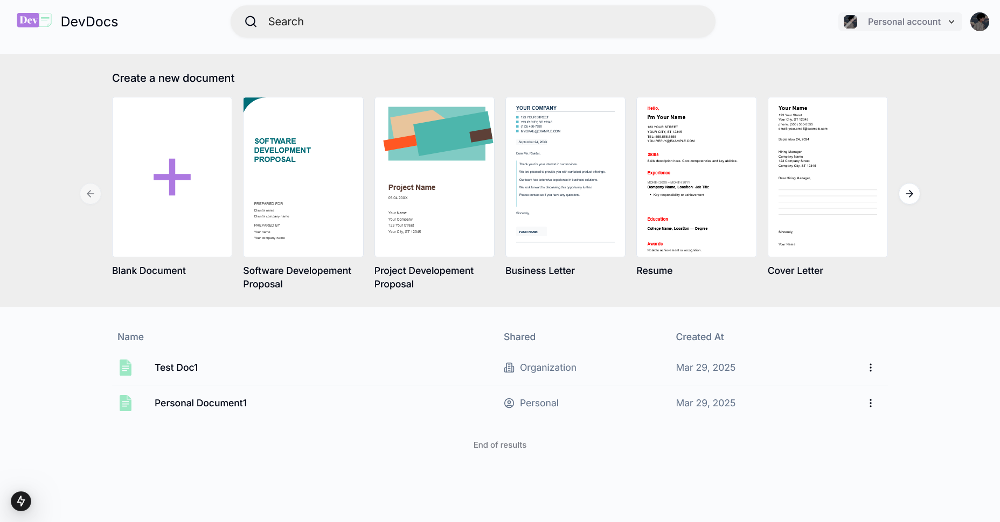

# 📌 DevDraws  

**DevDocs** is a real-time, collaborative web based document editor that enables users to create, edit, and share text content seamlessly. Whether you need to create a resume, write a letter, jot down notes, or collaborate remotely over a document, DevDocs provides an intuitive and interactive experience.  

  

## ✨ Features  

- 📝 **Real-time Collaboration** – Multiple users can edit documents simultaneously with Liveblocks-powered sync.
- ✍️ **Rich-Text Editing** – Format text with bold, italic, underline, lists, links, images, and more.
- 🎨 **Custom Styling** – Apply colors, headings, and highlight important content.
- 📄 **Print & Export** – Easily print documents or export them to various different formats.
- 🔥 **Undo/Redo Support** – Revert or reapply changes effortlessly.

## 🚀 Getting Started  

### **1. Clone the Repository**  

```

git clone https://github.com/dydipanshu/DevDocs.git

cd devdraws

```

### **2. Install required dependencies**

```

npm install
or
pnpm install (use for this project)
or
yarn install
or
bun install (reccomended)

```

### **3. Run the development server**

```

npm run dev
or
pnpm run dev (use for this project)
or
yarn run dev
or
bun run dev (reccomended)

```

Open [http://localhost:3000](http://localhost:3000) with your browser to see the result.

This project uses [`next/font`](https://nextjs.org/docs/basic-features/font-optimization) to automatically optimize and load Inter, a custom Google Font.

## 🏗 Tech Stack

- Next.js – React framework for server-side rendering and routing.
- Tiptap – A customizable, WYSIWYG editor for rich-text editing.
- Liveblocks – Real-time collaboration with shared document state.
- Shadcn UI – Modern, accessible, and customizable component library.
- Tailwind CSS – Utility-first styling framework for rapid development.

## 🛠 Contributing

We welcome contributions! Follow these steps:
- Fork the repo and create a new branch.
- Make your changes and commit with a clear message.
- Submit a Pull Request (PR) for review.


## Learn More

To learn more about Next.js, the tech stack used to build this project you can take a look at the following resources:

- [Next.js Documentation](https://nextjs.org/docs) - learn about Next.js features and API.
- [Learn Next.js](https://nextjs.org/learn) - an interactive Next.js tutorial.
